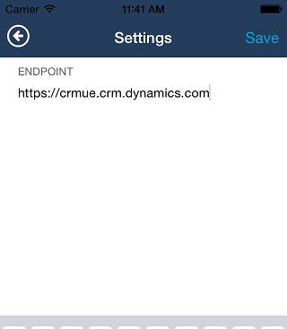
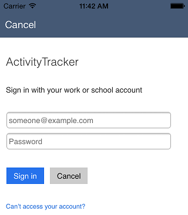
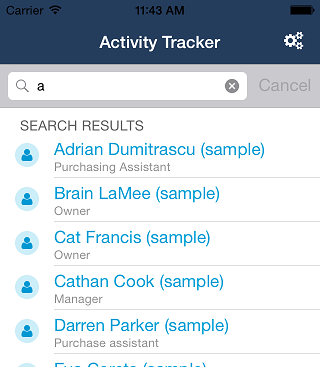
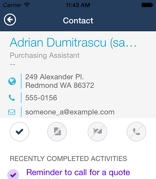
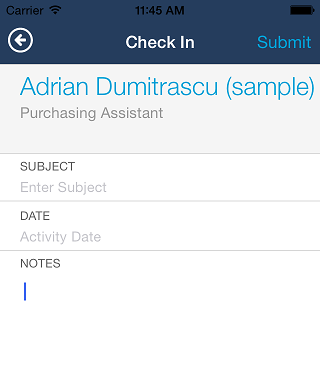

# iOS Activity Tracker Sample App for Microsoft Dynamics CRM

These instructions describe how to build and run the sample iOS Activity Tracker application.

## Register the application

Applications that access CRM business data, using the OAuth identity provider of the organization web service, must be registered in Active Directory. For an on-premises/IFD CRM deployment, AD FS 3.0 (or later) is used to register the app. With CRM Online, Microsoft Azure Active Directory is used for app registration. The result of application registration is a client ID value and a redirect URI that must be placed into the sample application's code where indicated in the next section. These values are used in the authentication process to determine whether the app has permission to access the organization's data.

For information on how to register an application, see [Walkthrough: Register a CRM app with Active Directory](https://msdn.microsoft.com/en-us/library/dn531010.aspx).

For internal app testing, you can share a single app registration across multiple apps. An app registration contains a single client ID, but can include multiple redirect URI's. For testing, you can add a redirect URI for each app you are developing. Once you are ready to publish an app to the Apple Store, the app need's its own registration.

## Build the application

To build the sample app, follow these steps. You will need CocoaPods installed to resolve the project dependencies. Follow the instructions from [CocoaPods.org](https://guides.cocoapods.org/using/getting-started.html).

0. Download the project dependencies by running `pod install`. The dependencies that will be installed are the [Microsoft ADAL](https://github.com/AzureAD/azure-activedirectory-library-for-objc) and the [Microsoft Dynamics CRM Mobile SDK Library for iOS](https://github.com/DynamicsCRM/crm-mobilesdk-library-for-ios).
1. Load the ActivityTracker.xcworkspace file, located in the ActivityTracker folder, into Xcode.
2. Set the active scheme to the ActivityTracker target.
3. Edit the AppDelegate.m file. On line 44 in the code file, change the provided value of `clientWithClientID` to the client ID value from your app registration.
5. On line 44 in the code file, change the provided value of `redirectURI` to the redirect URI value from your app registration.
6. Build the application.

## Run the application

On the mobile device where you deployed the app, choose the Activity Tracker app to start it. The following screens show how to access the features of the app.

Page | Visual Navigation | Description
------- | ---- | ----
Server and account |  | Enter the https:// root address of your CRM server, including the name of your domain, and the username of the logon system user account. If you do not know the URL, you can find it in the CRM web application by navigating to **Settings > Customization > Developer Resources**. An example URL would be: https://mydomain.crm.dynamics.com. Choose **Start Login** to continue.
Logon credentials | | Enter your the system user account password, for the organization that you specified on the previous page, and choose **Sign in**.
Search |  | The main page is initially blank with no contacts showing. Choose the search icon and enter one or more letters to find all contacts whose full name contain those letters.
Contact details |  | From the search results, choose a contact to display the details for that contact. On the details page, you can choose the street address to see that location on a map, the phone number to call the contact, or the email icon to send an email. All activities for that contact are shown below the command bar. Note that only the check mark command is enabled. The other commands are just place holders.
New activity |  | Choose the check mark icon on the details page to create a new activity for the contact. Enter the requested information. If the fields are not emtpy, containing data from the last activity, just clear the old data and enter the new data. Choose the check mark again to save the activity record and return to the details page.
